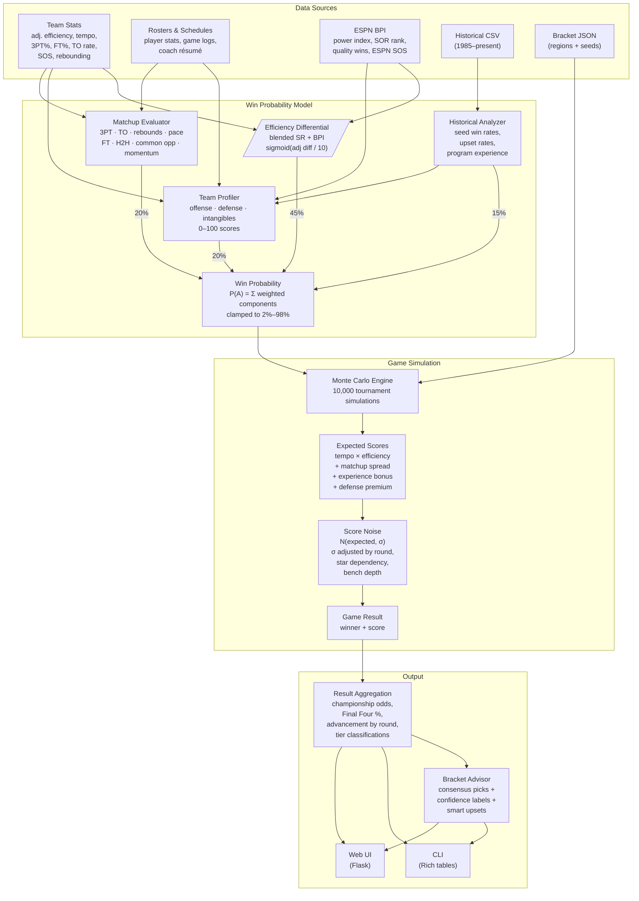

# NCAA March Madness Bracket Prediction Engine

A data-driven March Madness bracket prediction system that builds composite team profiles and runs Monte Carlo simulations to generate a complete predicted bracket with confidence levels and upset picks.

## Quick Start

```bash
pip install -r requirements.txt

# Scrape current-year team stats (optional — 2026 data included)
python scrape_real_data.py
python scrape_team_details.py
python scrape_espn_bpi.py

# Run a full simulation (10,000 iterations)
python cli.py simulate

# Get a complete bracket recommendation with upset picks
python cli.py advisor -n 10000

# Chaos-style bracket (bias toward underdogs)
python cli.py advisor -n 10000 --chaos --chaos-strength 50

# View a team profile
python cli.py profile "Duke"

# Head-to-head matchup analysis
python cli.py matchup "Duke" "Arizona"

# Historical seed trends
python cli.py history --seed 12

# Predicted bracket
python cli.py bracket -n 5000

# Launch web UI
python -m src.web.app
```

## How It Works

Every matchup produces a **win probability** from four weighted components, which then feeds into a Monte Carlo simulation engine that models actual game scores.



### 1. Historical Seed Data (15%)

A lookup table of seed-vs-seed win rates built from decades of tournament results. Known rates are hardcoded for common matchups (1v16: 99.3%, 2v15: 94.3%, 5v12: 64.7%, 8v9: 51.3%, etc.). For rarer seed combinations, rates are computed from the historical CSV, falling back to a formula based on seed difference when data is sparse.

This component also drives **program experience scoring**: for each team, the system looks back 10 years and counts tournament appearances + wins × 0.5 to produce an experience score that affects later-round simulations.

### 2. Efficiency Differential (45%)

The heaviest-weighted factor. Each team's **offensive efficiency** (points per 100 possessions) and **defensive efficiency** are compared — but raw numbers are first corrected for **strength of schedule (SOS)**.

**SOS Adjustment**: Raw efficiency stats from Sports Reference are not opponent-adjusted, so a mid-major running up numbers against weak opponents would look artificially strong. The system applies a correction using `SOS_ADJUSTMENT_FACTOR` (default 0.5):

```
adjusted_OE = raw_OE + (SOS × factor / 2)
adjusted_DE = raw_DE - (SOS × factor / 2)
adjusted_NET = adjusted_OE - adjusted_DE
```

A team with SOS = +13 (tough schedule, e.g. Big Ten) gets a +6.5 boost to their net efficiency. A team with SOS = -8 (weak schedule, e.g. Big South) gets a -4.0 penalty. This closes the gap between inflated mid-major stats and deflated power-conference stats.

The SOS-adjusted net efficiency difference is then **blended with ESPN's BPI** to create a consensus power rating. BPI is a forward-looking predictive metric (expected point margin per 70 possessions vs. an average team), while Sports Reference efficiency is backward-looking. Combining both creates an ensemble effect:

```
blended_diff = SR_adj_net_diff × 0.6 + BPI_diff × 0.4
P(A wins) = sigmoid(blended_diff / 10.0)
```

When BPI data is unavailable, the system falls back to SR-only. A team with a +10 blended efficiency edge gets roughly a 73% win probability from this component alone.

### 3. Team Profiles (20%)

Each team is scored 0–100 on three dimensions, normalized against the tournament field:

- **Offensive Score (40% of composite)** — Adjusted offensive efficiency, min-max normalized across all tournament teams
- **Defensive Score (40% of composite)** — Adjusted defensive efficiency (inverted — lower is better), min-max normalized
- **Intangible Score (20% of composite)** — Average of up to 10 sub-factors:
  - Strength of schedule (normalized)
  - Tournament experience (from historical data)
  - Last 10 games win rate
  - Overall win percentage
  - Coach tournament appearances (normalized)
  - Coach career win percentage (normalized)
  - ESPN Strength of Record rank (inverted — lower rank = better)
  - Quality win ratio (wins / total vs. top-50 BPI teams)
  - Scoring balance (1 − top scorer's share of points)
  - Rotation depth (players with 10+ MPG, normalized)

The composite score difference between two teams is passed through a logistic function (scaled by 25.0) to produce the profile probability component.

The profiler also flags **strengths** (elite offense/defense, 37%+ from 3, 77%+ FT, low turnovers, deep bench, tournament-tested coach, hot streak, etc.) and **weaknesses** (poor shooting, thin rotation, weak schedule, turnover-prone, inexperienced coach, etc.) based on percentile rank thresholds.

### 4. Matchup-Specific Adjustments (20%)

Eight style-matchup sub-factors are computed and summed, then passed through a logistic function:

| Factor | What it measures |
|--------|-----------------|
| **Perimeter battle** | Expected 3PT% for each team (own shooting vs. opponent's 3PT defense), difference scaled ×0.3 |
| **Turnover battle** | Each team's offensive TO rate + opponent's defensive TO rate — higher exposure = disadvantage |
| **Rebounding battle** | Offensive rebound rate vs. opponent's defensive rebound rate differential |
| **Pace mismatch** | When tempo differs by 3+ possessions, the team with the stronger SOS gets a small edge |
| **Free throw edge** | FT rate × FT% — the team getting to the line more often *and* making them has an advantage |
| **Head-to-head** | If the teams played this season, average margin of victory feeds directly into the adjustment |
| **Common opponents** | Average margin differential against shared opponents |
| **Momentum** | Weighted combination of last-10-game margin (40%), win rate (×5.0), and trend (second half vs. first half of the stretch) |

A small **coach nudge** is added on top: tournament appearances × 0.002 + Final Fours × 0.005 + championships × 0.008, clamped to ±0.05.

### Final Win Probability

```
P(A) = 0.15 × historical + 0.45 × efficiency + 0.20 × profile + 0.20 × matchup + coach_nudge
```

Clamped to [0.02, 0.98] so no outcome is ever treated as impossible.

### Monte Carlo Simulation Engine

Rather than just using win probabilities as coin flips, the engine **simulates actual game scores** for each matchup:

1. **Expected score**: possessions (average of both teams' tempo) × SOS-adjusted offensive efficiency × (opponent's SOS-adjusted defensive efficiency / league average) / 100. The win probability edge is converted to a point spread (±3 points per 0.5 probability deviation) and applied.

2. **Round-dependent bonuses** that increase in later rounds:
   - **Experience bonus** — Coach tournament résumé (60%) + program experience (40%), multiplied by a round premium that rises from 0.0 in R64 to 1.2 in the championship
   - **Defense premium** — Teams with elite defensive efficiency (below 105) get an increasing bonus that penalizes their opponent's expected score in later rounds
   - **Bench depth bonus** — Teams with 8+ rotation players get reduced variance in later rounds; thin rotations (≤5) get increased variance

3. **Score noise**: each team's score is drawn from a normal distribution around their expected score. Base standard deviation is 9.0 points, adjusted by:
   - Round variance multiplier (shrinks from 1.0 in R64 to 0.75 in the championship — less chaos in later rounds)
   - Star dependency — teams with a top scorer taking >25% of points get amplified variance (boom-or-bust)
   - Bench depth — deep rotations compress variance, thin ones expand it

4. **Tie-breaking**: if the simulated scores tie, the win probability is used as a weighted coin flip.

The engine runs 10,000 full tournament simulations (including First Four play-in games) and aggregates championship wins, Final Four appearances, round-by-round advancement counts, and tier classifications (locks, likely, coin-flips, upsets).

### Bracket Advisor

After simulation, the advisor builds a deterministic consensus bracket (always picking the higher-probability team) and annotates each pick:

- **Lock** — High confidence pick
- **Strong** — Solid favorite
- **Lean** — Slight edge
- **Toss-up** — Could go either way

It also identifies **smart upsets**: lower-seeded teams with meaningfully better efficiency, profile, or matchup numbers than their seed suggests.

Recent advisor updates:

- **Sample-aware confidence source** — Picks now label whether displayed confidence comes from conditional Monte Carlo matchup outcomes (`SIM`) or the base matchup model (`MODEL`) when sample counts are too thin.
- **Championship score estimate** — Advisor output now includes an estimated combined total for the title game, expected team scores, and a typical range.
- **Chaos mode** — CLI and web flows support upset bias for users who want higher-volatility brackets.

## Data Pipeline

1. `scrape_real_data.py` — Pulls basic, opponent, and advanced stats from Sports Reference for all tournament teams.
2. `scrape_team_details.py` — Scrapes per-team pages for rosters (per-game player stats) and full season schedules.
3. `scrape_espn_bpi.py` — Fetches ESPN's Basketball Power Index (BPI), Strength of Record (SOR), quality wins vs. top-50, and SOS rankings via ESPN's JSON API.
4. All three scripts enrich the same `data/teams/{year}_teams.json`. The bracket (`data/brackets/{year}_bracket.json`) and historical results (`data/historical/tournament_results.csv`) are maintained separately.

## CLI Commands

| Command | Description |
|---------|-------------|
| `simulate` | Run Monte Carlo simulation with configurable iterations |
| `advisor` | Generate a complete bracket with confidence levels, reasoning, smart upset picks, and optional chaos-mode upset bias |
| `profile <team>` | Detailed team profile — stats, scores, strengths/weaknesses, roster, recent games |
| `matchup <team_a> <team_b>` | Head-to-head probability breakdown with per-factor analysis |
| `history` | Historical seed performance, upset rates, and advancement rates |
| `bracket` | Output predicted bracket with advancement probabilities per round |

All commands support `--year`, `--iterations` / `-n`, and `--seed` / `-s` flags where applicable.

## Web UI

Run `python -m src.web.app` and visit `http://localhost:5000`:

- **Bracket view** — Full tournament bracket with clickable teams
- **Team profiles** — Key metrics, composite scores, strengths/weaknesses, roster, schedule
- **Matchup analysis** — Pick any two teams for a head-to-head breakdown
- **Bracket advisor** — Streaming simulations plus full bracket recommendation with confidence labels, upset picks, chaos mode, cancellation, and cached last results in local storage

## Configuration

Edit `config.py` to tune:

| Parameter | Default | Description |
|-----------|---------|-------------|
| `CURRENT_YEAR` | 2026 | Target tournament year |
| `DEFAULT_ITERATIONS` | 10,000 | Number of Monte Carlo simulations |
| `WEIGHT_HISTORICAL` | 0.15 | Historical seed baseline weight |
| `WEIGHT_EFFICIENCY` | 0.45 | Efficiency differential weight |
| `WEIGHT_PROFILE` | 0.20 | Team profile composite weight |
| `WEIGHT_MATCHUP` | 0.20 | Style matchup adjustment weight |
| `LOGISTIC_SCALE` | 10.0 | Sensitivity of the efficiency logistic curve |
| `GAME_STDEV` | 9.0 | Score noise standard deviation |
| `SOS_ADJUSTMENT_FACTOR` | 0.5 | How much strength of schedule corrects raw efficiency |

Round-dependent multipliers for variance, experience premium, defense premium, bench depth bonus, and star dependency are also configurable.

## Project Structure

```
├── cli.py                        # CLI entry point (Click + Rich)
├── config.py                     # Global configuration and weights
├── requirements.txt              # Python dependencies
├── scrape_real_data.py           # Sports Reference team stats scraper
├── scrape_team_details.py        # Roster and schedule scraper
├── scrape_espn_bpi.py            # ESPN BPI, SOR, quality wins scraper
├── data/
│   ├── historical/
│   │   └── tournament_results.csv    # Game results 1985–present
│   ├── teams/
│   │   └── 2026_teams.json           # Team stats, rosters, schedules
│   └── brackets/
│       └── 2026_bracket.json         # Bracket seedings by region
├── src/
│   ├── data/
│   │   ├── models.py                 # Pydantic data models
│   │   ├── team_stats.py             # Team JSON loading/saving
│   │   └── collector.py              # Historical CSV loading/parsing
│   ├── analysis/
│   │   ├── historical.py             # Seed win rates, upset rates, experience
│   │   ├── profiler.py               # Team profile builder (0–100 scores)
│   │   ├── matchup.py                # Win probability evaluator
│   │   └── advisor.py                # Bracket advisor with confidence labels
│   ├── simulation/
│   │   ├── bracket.py                # Bracket model and region matchups
│   │   ├── engine.py                 # Monte Carlo simulation engine
│   │   └── results.py                # Result aggregation and tiers
│   └── web/
│       ├── app.py                    # Flask app with REST APIs
│       └── templates/                # HTML templates
└── tests/                            # Test suite
```
